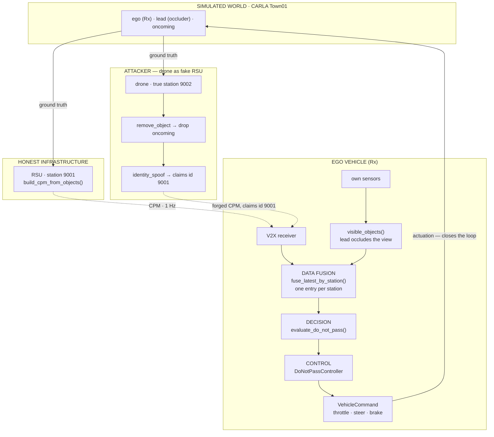

# Do-Not-Pass Warning spoofing — drone as a fake RSU

Whitepaper use case 1b (`White_paper___B5GCyberTestV2X.pdf`, Fig. 2): *"a collision
resulting from a spoofer drone sending false information masquerading as a Road Side
Unit (RSU)."*

A drone impersonating an RSU erases an oncoming vehicle from the cooperative-perception
stream, and the receiving car overtakes into it. The manoeuvre is produced by the
victim's own controller, not scripted — see [Why it is closed-loop](#why-it-is-closed-loop).

Code: `src/carla_spoofing/scenarios/do_not_pass_spoofing.py`

---

## 1. Architecture

```
                 ┌─────────────────────────────────────────────┐
                 │  SIMULATED WORLD  ·  CARLA Town01           │
                 │  ego (Rx) — lead (occluder) — oncoming      │
                 └──────────────────────┬──────────────────────┘
                                        │ ground-truth poses
                     ┌──────────────────┴──────────────────┐
                     ▼                                     ▼
 ┌─────────────────────────────────┐   ┌─────────────────────────────────┐
 │ HONEST INFRASTRUCTURE           │   │ ATTACKER — drone as fake RSU    │
 │                                 │   │                                 │
 │  RSU · station 9001             │   │  drone · true station 9002      │
 │  build_cpm_from_objects()       │   │  remove_object  → drop oncoming │
 │                                 │   │  identity_spoof → claims 9001   │
 └────────────────┬────────────────┘   └────────────────┬────────────────┘
                  │ CPM · 1 Hz                          │ forged CPM,
                  │                                     │ claims id 9001
                  └────────────────┐   ┌────────────────┘
                                   ▼   ▼
 ┌──────────────────────── EGO VEHICLE (Rx) ─────────────────────────────┐
 │                                                                       │
 │   V2X receiver ────────┐              own sensors                     │
 │                        │                   │                          │
 │                        │                   ▼                          │
 │                        │           visible_objects()                  │
 │                        │           (the lead occludes the view)       │
 │                        │                   │                          │
 │                        ▼                   ▼                          │
 │   ╔═══════════════════════════════════════════════════════════════╗   │
 │   ║ DATA FUSION    fuse_latest_by_station()                       ║   │
 │   ║ one entry per station — the newest CPM REPLACES the old one   ║   │
 │   ╚═══════════════════════════════════════════════════════════════╝   │
 │                                │ fused object list                    │
 │                                ▼                                      │
 │     DECISION    evaluate_do_not_pass()                                │
 │                 gap · closing speed · time to meet                    │
 │                                │ PASS / DO_NOT_PASS                   │
 │                                ▼                                      │
 │     CONTROL     DoNotPassController                                   │
 │                 FOLLOW → PASSING → RETURNING                          │
 │                                │                                      │
 │                                ▼                                      │
 │                 VehicleCommand · throttle, steer, brake               │
 └────────────────────────────────┬──────────────────────────────────────┘
                                  │ actuation — closes the loop
                                  └─────────────▶ back into the world

 every message, honest and forged, is also written to
 v2x_packets.jsonl · messages.csv · do_not_pass_decisions.csv   → OMNeT++
```

The attacker only transmits. Everything that makes the car move sits **inside** the ego:
fusion, the warning, and the controller — and the controller's only trigger for an
overtake is the warning it just computed from received messages.

<details>
<summary>Same diagram as Mermaid (renders on GitHub / VS Code preview)</summary>



</details>

---

## 2. Why it has to impersonate the RSU

Dropping the oncoming vehicle from a message is not enough on its own. A receiver keeps
**one entry per sending station**, so what the forgery is *signed as* decides whether it
adds to the ego's world model or overwrites part of it.

```
  FORGED UNDER THE DRONE'S OWN ID              FORGED UNDER THE RSU'S ID
  ───────────────────────────────              ─────────────────────────

  RSU   9001  {ego, lead, oncoming}            RSU   9001  {ego, lead, oncoming}
  drone 9002  {ego, lead}                      drone 9001  {ego, lead}   ← claims
        │                                            │
        ▼  fuse_latest_by_station()                  ▼  fuse_latest_by_station()
  two stations, both kept → UNION               one station, newest wins → REPLACED
        │                                            │
        ▼                                            ▼
  {ego, lead, oncoming}                         {ego, lead}
  the oncoming car survives                     the oncoming car is erased
        │                                            │
        ▼                                            ▼
  DO_NOT_PASS — suppression fails                PASS — the ego pulls out
```

The only difference between the two columns is the station id on the forged message.
`tests/test_do_not_pass.py::test_impersonated_cpm_supersedes_the_genuine_one` asserts
that the left-hand case genuinely fails, so the mechanism cannot quietly rot.

---

## 3. Running it

Both scenarios already exist: `honest` is the happy path, `spoofed` is the sad one, and
the default `both` runs them back to back and writes the comparison.

### Terminal 1 — the simulator

```bash
cd ~/proj/carla-spoofing
make up                        # or: docker compose -f docker/docker-compose.yml up carla-sim
```

The sim **starts on Town01** (the compose default), so the usual run reloads nothing.

> **Do not switch maps at runtime in this build.** `client.load_world()` has to tear down
> a level while a second client (the container's `auto_traffic.py`) still owns actors and
> the AirSim plugin sits in the same UE4 process. On identical inputs it completed twice
> and hung indefinitely twice. The scenario will still attempt it if it finds the wrong
> map, but the attempt is time-boxed to 120 s and then tells you to restart the sim on the
> right map. A notebook against vanilla CARLA does not hit this — there, `load_world` runs
> first, on an empty world, with no second client and no flight-physics plugin attached.

### Where the drone comes from

CarlaAir's drone is an AirSim multirotor that spawns wherever AirSim puts it. The
scenario teleports it to the roadside fake-RSU pose at startup (`simSetVehiclePose`,
no flight across the map) and reports what it did:

```
drone placed at (392.8, 107.6, 14.9), hovering [offset=(0.0, 0.0, 0.0)]
```

The `offset` is the measured AirSim-to-CARLA frame difference. `--no-fly-drone` skips
the whole step — the drone's pose is cosmetic, since a forged CPM claims the
impersonated station's position rather than the attacker's.

### Where the drone hovers — `--drone-back`

The surveyed pose sits directly over the RSU anchor, which is roughly where the ego
ends up when the spoofed overtake goes wrong. The drone therefore hovered right on
top of the crash, with the whole scene squeezed underneath it. The hover spot is now
derived from the road graph instead, a set distance **behind the ego's start**:

```
            drone ▾ (default: 2.5 m in front of the ego start)
   ego ───────────────► lead ──────────────► · · · ◄──────── oncoming
   -55m     -52.5m       -25m                RSU 0m           +55m
   └────────────── looking down the road, this way ──────────►
```

Distances are metres along the road from the RSU anchor; `--drone-back` counts
**backwards from the ego's start**, so a negative value is *in front* of it.

Only the position *along* the road changes. Altitude and the sideways offset from the
lane centre are carried over from the surveyed pose, measured in the anchor waypoint's
own right-vector and re-laid against the hover waypoint's, so the drone stays over the
same verge at the same height even if the segment curves. Its yaw is taken from the
lane heading, which is by construction the direction the ego drives.

| | |
|---|---|
| `--drone-back -2.5` | default — just ahead of the ego, whole manoeuvre in front of the camera |
| `--drone-back 15` | behind the ego, wider shot |
| `--drone-back -55` | the surveyed pose, directly over the RSU and over the crash |

The default was settled by eye: 15 m behind the ego overshot, so it sits a quarter
of the way back toward the surveyed pose.

**Backing off has a limit, and the scenario enforces it.** The attacker forges by
*deleting* the oncoming car from what it honestly perceives. Park it far enough back
that the car was never within its 160 m perception range and there is nothing to
delete — yet the run still ends in a collision, because an impersonated message
replaces the RSU's genuine one whether or not the attacker edited it. The outcome then
looks like a successful attack while actually being an artifact of sensor range, with
the only evidence an empty `removed_ids` column. Any configuration that would do this
is called out before the run starts:

```
[dnp] WARNING: the oncoming car starts 190 m from the drone, beyond its 160 m
perception range, so early forged messages have nothing to suppress -- any collision
is a sensor-range artifact, not the attack. Reduce --drone-back (or --oncoming-ahead),
or raise the drone's range.
```

### Terminal 2 — the scenario

```bash
make do-not-pass               # happy + sad, then the verdict
make do-not-pass RUN=honest    # just the happy path
make do-not-pass RUN=spoofed   # just the sad path
```

### No simulator at all

```bash
make do-not-pass-mock   # same closed loop on a kinematic bicycle model, no GPU
make test               # 18 unit tests, incl. the end-to-end mock verdict
```

### Reading the result

```bash
cat out/do_not_pass/comparison.json

# the decision flip, round by round
column -s, -t out/do_not_pass/spoofed/do_not_pass_decisions.csv | less -S

# who sent what, and what was faked
column -s, -t out/do_not_pass/spoofed/messages.csv | less -S
```

---

## 4. What you see in the window

It runs in windowed CARLA, and the spectator is moved automatically to the lateral pose
from the earlier CarlaNetpp run, so the whole segment is framed without flying the camera.

| | what happens |
|---|---|
| **Honest run** | The ego closes on the slow lead and *sits behind it* while the oncoming car approaches and passes. Only then does it pull out, overtake, and tuck back in. |
| **Spoofed run** | The ego pulls out almost immediately, accelerates, and meets the oncoming car head-on. Same scene, same controller — only the message stream differs. |

Two things to expect:

- The scenario drives the clock itself (synchronous mode, 0.05 s steps), so the window
  advances in step with the run rather than free-running.
- `RUN=both` spawns and destroys its own three cars for each run, so the scene resets
  once in the middle.

---

## 5. Measured outcome

Live CARLA, Town01, 2026-09-17. An overtake on its own is **not** the failure — the
honest ego is supposed to overtake eventually. The failure is overtaking while a hazard
is genuinely there, so each run is scored against an omniscient ground-truth decision at
the moment the pass becomes uncommittable.

| | honest run | spoofed run |
|---|---|---|
| pulls out at | t = 7.0 s | t = 0.6 s |
| pass committed at | t = 7.85 s | t = 1.45 s |
| ground truth then | `PASS` | `DO_NOT_PASS` |
| outcome | completes the pass, back in lane at 14.7 s | **head-on with `vehicle.tesla.model3` at t = 5.45 s, 11.7 m/s** |
| collision | none | yes, the oncoming vehicle |

```
attack_caused_unsafe_overtake: true
attack_caused_collision:       true
```

The messages behind it, round 0 of the spoofed run:

```
sender 9001  claims 9001  rsu      honest    6 objects
sender 229   claims 229   vehicle  honest    3 objects
sender 198   claims 9001  drone    spoofed   5 objects   removed=231
```

Sender 198 is the drone, claiming to be station 9001 — the RSU. Object 231 is the
oncoming car it deleted.

**Nothing broadcasts a warning.** The RSU sends only perceived objects; the ego computes
`PASS` / `DO_NOT_PASS` itself and logs its reasoning:

```
t=3.0  DO_NOT_PASS  oncoming car 231: gap 56.0 m <= 70 m; time-to-meet 2.8 s <= 10 s
```

That is why the attack deletes an object rather than forging a warning flag: the victim's
logic is untouched and works perfectly, over a poisoned world model.

**An emergent detail worth keeping.** In the spoofed run the ego detects the oncoming car
with its *own* sensors at t = 3.0 s — once it is in the opposing lane the lead no longer
occludes it — and the warning correctly flips back to `DO_NOT_PASS`. But the pass was
committed at t = 1.45 s, so it is too late. That behaviour was not coded; it falls out of
the occlusion model plus the commitment threshold.

## Why it is closed-loop

The earlier version of this experiment
(`~/proj/CarlaNetpp/cooperative_perception_dev/use_case_1/main.py`) staged its collision:
at `time.time() - starting_time > 7.8` it called `apply_control(throttle=1, steer=-1)` and
the car swerved into the opposing lane regardless of what any message said. Its "attack"
was an unrelated GNSS timestamp shift written to a CSV that never touched vehicle
behaviour — so the identical crash happens with the attack switched off.

Here the ego has no script. Feed it honest messages and it stays put; feed it the forged
ones and it overtakes, with nothing else different between the two runs. The controllers
are deliberately crude — pure pursuit plus a proportional speed controller — because
anything fancier would hide the mechanism behind a black box.

---

## Status

**Verified end to end in live CARLA on 2026-09-17**, plus the mock backend and the test
suite. Road-graph placement, the drone teleport and the closed-loop collision all work.

Measured on the live run: the AirSim-to-CARLA frame offset is `(-203.0, -188.1, 1.9)` —
AirSim's origin sits ~275 m from CARLA's, which is why a drone spawn pose expressed in raw
CARLA coordinates cannot work.

## Scene provenance

Map, weather, drone hover pose and spectator framing are reused verbatim from
`~/proj/CarlaNetpp/cooperative_perception_dev/use_case_1/main.py`:

| | value |
|---|---|
| map / weather | `Town01` / `CloudyNoon` |
| drone hover pose | `Location(392.791443, 107.608482, 14.855516)`, `Rotation(pitch=-27.212101, yaw=-89.532944)` — now the anchor for altitude and roadside offset only; the position along the road comes from `--drone-back` |
| RSU (impersonated) | same spot at pole height, `z = 6.0`, station id `9001` |
| spectator | `Location(377.332733, 125.954506, 35.793575)`, `Rotation(pitch=-54.568348, yaw=-0.546539)` |
| original spawn points | 181 ego · 177 lead · 163 oncoming — recorded for provenance, **not used** |

Those indices are not reused. They are CARLA 0.9.13 numbering that may point anywhere on
this 0.9.16 CarlaAir build, and in the original the traffic manager drove the cars into
formation over ~8 s rather than starting in it — a closed-loop run needs a defined
starting formation. Placement is therefore always derived from the road graph around the
same segment.
